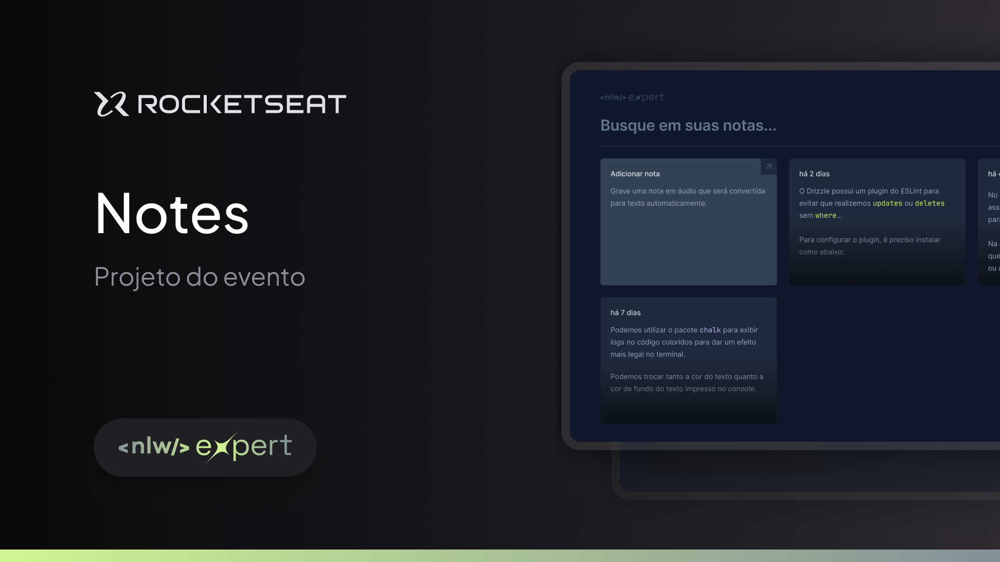

# Notes

Aplicação desenvolvida durante o NLW Expert da [Rocketseat](https://www.rocketseat.com.br/?utm_source=google&utm_medium=cpc&utm_campaign=lead&utm_term=perpetuo&utm_content=institucional-lead-home-texto-lead-brandkws-none-none-institucional-none-none-br-google&utm_term=rocketseat&utm_campaign=PROGRAMAS-ALL-BRANDKWS-SEM&utm_source=adwords&utm_medium=cpc&hsa_acc=8545075154&hsa_cam=16048648686&hsa_grp=135825188594&hsa_ad=579096962131&hsa_src=g&hsa_tgt=kwd-679159515078&hsa_kw=rocketseat&hsa_mt=b&hsa_net=adwords&hsa_ver=3&gad_source=1&gclid=CjwKCAiAt5euBhB9EiwAdkXWO7GuMQ4TPepqT_VmVur4REAUT9vAf617OSaINkGUpeUauFm6guKbkxoCwTAQAvD_BwE) que converterá automaticamente notas de áudio em texto com React



## Índice

- [Ferramentas](#ferramentas)
- [Instalação](#instalação)
- [Projeto](#projeto)
- [Layout](#layout)
- [Licença](#licença)

## Ferramentas

- [Vite](https://vitejs.dev/) v5.0.8
- TypeScript v5.2.2
- [Tailwind CSS](https://tailwindcss.com/) v3.4.1
- [React](https://react.dev/) v18.2.0
- [Radix UI](https://www.radix-ui.com/) v1.0.5
- SpeechRecognition API

## Instalação

Siga as etapas abaixo para configurar e instalar o Notes em seu ambiente local:

1. Clone o repositório e acesse o diretório:

```bash
git clone git@github.com:brunohnsouza/nlw-expert.git
cd nlw-expert
```

2. Instale as dependências do projeto:

```bash
npm install
```

3. Inicie o servidor em modo de desenvolvimento:

```bash
npm run dev
```

Acesse http://localhost:5173 para visualizar a aplicação.

## Projeto

Veja o projeto online [clicando aqui]()

## Layout

[Figma](https://www.figma.com/community/file/1336456128647909148) do projeto

## Licença

[MIT](https://choosealicense.com/licenses/mit/)
